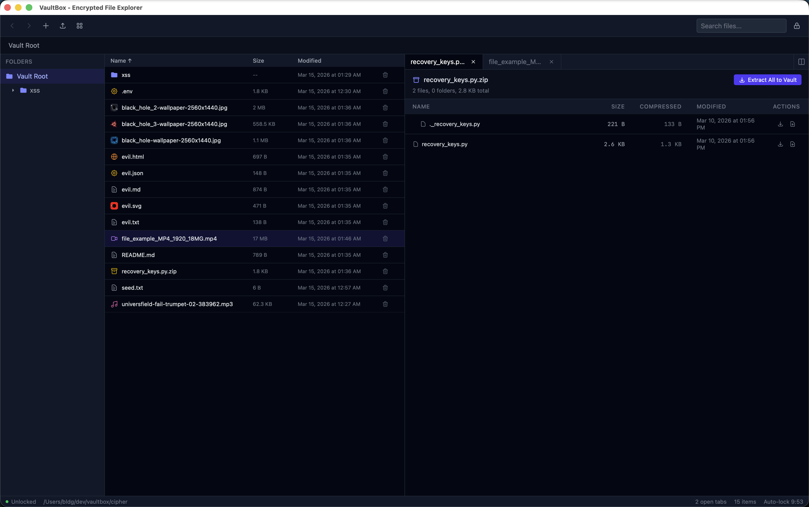

# VaultBox

[](https://github.com/bldgk/vaultbox/actions/workflows/ci.yml)
[](https://github.com/bldgk/vaultbox/actions/workflows/build.yml)

A desktop application for browsing gocryptfs-encrypted vaults without mounting them. All decryption happens in-process memory — no FUSE mount, no temp files on disk, no plaintext exposed to other apps.

Cryptographic compatibility with gocryptfs v2 is verified by cross-validation tests: files encrypted by [gocryptfs](https://github.com/rfjakob/gocryptfs) are decrypted by VaultBox and vice versa.



> **Warning:** This is an experimental project. The cryptographic implementation has not been independently audited. There may be bugs that corrupt data or compromise security. **Use at your own risk.** Do not rely on this as your only way to access important encrypted data — always keep backups.

## Features

### Vault Management
- Open and browse gocryptfs v2 encrypted vaults
- Create new encrypted vaults with password strength indicator and master key backup
- Auto-lock after 10 minutes of inactivity
- Zero plaintext on disk — everything stays in memory

### File Viewers
- **Text editor** — CodeMirror 6 with syntax highlighting for 15+ languages, Cmd+S to save; each tab runs in an isolated webview for V8 heap isolation
- **Markdown preview** — Live split-view rendering with toggle button
- **PDF viewer** — pdfjs-dist with zoom, fit-width/fit-page, page navigation, scroll tracking
- **Image viewer** — Inline preview with fullscreen mode, zoom, pan, double-click to toggle
- **Media player** — Streaming video/audio via `vaultmedia://` protocol with HTTP Range support
- **Archive viewer** — Browse .zip contents with tree view; extract individual files or all to vault/disk
- **Hex viewer** — Binary inspection with offset/hex/ASCII display
- Files up to 2 GB can be opened in-app; larger files can be exported to disk

### File Operations
- Create, rename, copy, move, delete, import, export
- Batch operations — multi-select for Export All, Copy All, Delete All
- Move to folder via right-click context menu with flyout submenu
- Search across decrypted filenames
- Cmd+N to create new file, Cmd+Shift+N for new folder

### UI
- Split view — side-by-side file comparison (Alt+click tab for right pane)
- Tab reorder via pointer drag
- File type icons — unique colored SVGs for code, config, markup, audio, archive, shell, PDF
- Image gallery — fullscreen thumbnail strip with keyboard navigation (arrows, Home, End)
- File info panel (Cmd+I) — file type, size, dates, path, image preview
- Custom confirm dialogs for all destructive actions
- ARIA labels, roles, and keyboard navigation across all interactive elements
- Dark theme (gray-950), Tailwind CSS v4

## Security Model

VaultBox is designed to keep decrypted data isolated to a single process, unlike gocryptfs FUSE mounts which expose plaintext to all processes via the filesystem.

| | gocryptfs FUSE mount | VaultBox |
|---|---|---|
| Plaintext access | Any process can `open("/mnt/vault/file")` | Only VaultBox process |
| Malware with user privileges | Reads files like normal files | macOS/Linux: blocked by OS |
| Kernel page cache | Decrypted pages cached by kernel | No kernel cache |
| Visibility | Mount point visible via `mount`, `df` | No mount point |

### Memory protection

| Protection | How | Platform |
|------------|-----|----------|
| Isolated webviews | Each text editor tab runs in a separate child webview; closing a tab destroys the entire V8 heap, reclaiming all decrypted content | All |
| XOR-masked keys | Keys stored as `masked = key ⊕ random_mask`; unmasked only during crypto operations (microseconds), then re-masked with fresh random pad | All |
| mlock | All key material and plaintext cache entries pinned in RAM via `mlock()` / `VirtualLock()` — never swapped to disk | All |
| Zeroize on drop | Keys, passwords, decrypted buffers zeroed via volatile writes (`zeroize` crate) — compiler cannot optimize away | All |
| GC pressure on close | Tab close and vault lock overwrite editor document content and allocate throwaway buffers to encourage V8 garbage collection | All |
| Core dumps disabled | `setrlimit(RLIMIT_CORE, 0)` at startup | Unix |
| Anti-ptrace | `prctl(PR_SET_DUMPABLE, 0)` — blocks `/proc/pid/mem` reads and `ptrace` attach from same-user processes | Linux |

### Password handling

| Layer | Type | Zeroed after use? |
|-------|------|-------------------|
| `useSecurePassword` hook | `number[]` (mutable ref, not a JS string) | Yes — `fill(0)` on consume |
| IPC transport | `Uint8Array` → `number[]` | Yes — both zeroed in `finally` |
| Rust command handler | `Vec<u8>` → `String` for scrypt | Yes — both `.zeroize()` after KDF |

### Network isolation

| Layer | Mechanism |
|-------|-----------|
| CSP `connect-src` | `'self' ipc: http://ipc.localhost vaultmedia:` — blocks all external HTTP/WebSocket |
| No plugins with network access | `opener` plugin removed; only `dialog` plugin remains |
| Rust code | No `reqwest`, `hyper`, or any HTTP client in dependencies |

### Filesystem restrictions

| Mechanism | What it does |
|-----------|-------------|
| Tauri capabilities | Minimal: `core:default` + `dialog:allow-open` + `dialog:allow-save` only |
| `validate_external_path()` | Import/export blocked for `/etc`, `/System`, `/usr`, `/bin`, `/proc`, `/sys`, all hidden directories (`.ssh`, `.gnupg`, `.aws`, `.config`, etc.) |
| Vault operations | Path resolution constrained to `vault_path` — no traversal outside vault directory |

### Content rendering safety

All vault content is rendered safely — no user-supplied scripts can execute:

| Content type | Rendering method | Script execution |
|-------------|-----------------|-----------------|
| HTML, SVG, JSON, TXT | CodeMirror text editor | Impossible — displayed as source code |
| Markdown preview | Custom renderer with `escapeHtml()` | Blocked — HTML tags escaped, `javascript:` links stripped |
| Images (including SVG) | `` | Blocked — browsers don't execute scripts in `` tags |
| PDF | pdfjs-dist canvas rendering | Blocked — pdfjs does not execute embedded JS |
| Archives (.zip) | Metadata parsing only | Impossible — no content rendering |

### Known limitations

- JavaScript strings are immutable and GC'd, not zeroized — decrypted text in open editor tabs persists in isolated webview JS heap until the tab is closed (destroying the webview)
- On Windows, `ReadProcessMemory` from a same-user process can read VaultBox memory; XOR masking makes this harder but not impossible for a targeted attacker
- CodeMirror editor maintains internal copies of document content in JS heap (mitigated by isolated webviews — each editor gets its own heap)

## Architecture

- **Frontend**: React 19 + TypeScript + Tailwind CSS 4 + CodeMirror 6 + pdfjs-dist
- **Backend**: Rust (Tauri v2) handling all crypto operations
- **Webviews**: Multi-webview architecture (Tauri v2 `unstable` feature) — each text editor tab runs in a separate child webview for V8 heap isolation
- **Crypto**: AES-256-GCM (128-bit nonces) content encryption, EME (ECB-Mix-ECB) filename encryption, scrypt + HKDF-SHA256 key derivation
- **IPC**: Tauri `invoke()` — in-process, not over network sockets; cross-webview communication via Tauri events
- **Media**: Custom `vaultmedia://` protocol for streaming decrypted video/audio with HTTP Range support

## Prerequisites

- [Node.js](https://nodejs.org/) (v18+)
- [Rust](https://rustup.rs/) (stable)
- [Tauri v2 prerequisites](https://v2.tauri.app/start/prerequisites/)

## Development

```bash
npm install
npm run tauri dev
```

## Build

```bash
npm run tauri build
```

The bundled app will be in `src-tauri/target/release/bundle/`.

## Tests

```bash
# Rust tests
cd src-tauri
cargo test

# Frontend tests
npm test
```

362 tests across 8 test suites:

| Suite | Tests | What's covered |
|-------|------:|----------------|
| Unit tests (`--lib`) | 203 | AES-256-GCM content encryption (16-byte nonces, 24-byte AAD), EME filename encryption, HKDF key derivation with known vectors, scrypt KDF, config parsing, streaming decryption, vault state management, LRU cache with mlock/zeroize, XOR-masked key storage, core dump prevention |
| `crypto_pure` | 78 | HKDF known vectors from gocryptfs, real vault KDF validation, block size/offset monotonicity, range splitting, content roundtrips (0B–10MB), filename roundtrips (dot names, Unicode, 300-char), AAD format verification, corruption detection, concurrent encrypt/decrypt, performance benchmarks, security edge cases |
| `vault_ops` | 25 | Full vault CRUD on real encrypted structures: create/read/write/rename/delete/copy/search, nested directories, Unicode names, plaintext-not-on-disk verification |
| `memory_security` | 22 | Zeroize verification via raw pointers (decrypt results, derived keys, LockedKey temporaries), mlock lifecycle, key isolation, no plaintext leakage in ciphertext/filenames, scrypt brute-force resistance, XOR-masked key roundtrips |
| `gocryptfs_compat` | 6 | Cross-validation with real gocryptfs binary: VaultBox decrypts gocryptfs-created files, gocryptfs decrypts VaultBox-created files, config/key derivation compatibility |
| `debug_kdf` | 3 | Step-by-step KDF comparison with Go output (scrypt → HKDF → GCM → master key), pure HKDF vector validation |
| Frontend (Vitest) | 25 | React component rendering, file store state management, file type detection, viewer selection logic |

### Fuzz testing

Fuzz targets for crypto modules are in `src-tauri/fuzz/`. They use [cargo-fuzz](https://github.com/rust-lang/cargo-fuzz) (libFuzzer) to find panics, crashes, and roundtrip violations.

```bash
# Prerequisites
rustup toolchain install nightly
cargo install cargo-fuzz

# Run a fuzz target (from src-tauri/)
cargo +nightly fuzz run fuzz_content_decrypt -- -max_total_time=300
```

| Target | What it fuzzes |
|--------|---------------|
| `fuzz_content_decrypt` | Arbitrary bytes → `decrypt_file()` — no panics or OOM |
| `fuzz_content_roundtrip` | `encrypt_file(x)` → `decrypt_file()` == `x` for all inputs |
| `fuzz_filename` | Arbitrary strings → filename decrypt + encrypt→decrypt roundtrip |
| `fuzz_eme` | EME encrypt→decrypt roundtrip for all block-aligned inputs |

### Security audit commands

```bash
cd src-tauri

# Check dependencies for known vulnerabilities (CVEs)
cargo audit

# Count unsafe blocks in the dependency tree
cargo geiger

# Search for unsafe in VaultBox source (should only be in security/ primitives)
grep -rn "unsafe" src/
```

**Unsafe audit summary** (VaultBox source only):

| Location | Count | Purpose |
|----------|------:|---------|
| `security/mlock.rs` | 4 | `libc::mlock`/`munlock` system calls |
| `security/coredump.rs` | 2 | `libc::setrlimit` to disable core dumps |
| `vault/cache.rs` | 1 | `read_volatile` in tests |
| `security/locked_key.rs` | 1 | `read_volatile` in tests |
| `crypto/` | 0 | No unsafe in any crypto module |

### Cross-validation (requires FUSE)

Three tests require macFUSE/FUSE to mount a gocryptfs filesystem:

```bash
# Set gocryptfs binary path (or add to PATH):
export GOCRYPTFS_BIN=/path/to/gocryptfs

cargo test --test gocryptfs_compat -- --ignored --nocapture
```

These tests verify bidirectional compatibility:
- **gocryptfs → VaultBox**: Create files with gocryptfs mount, decrypt filenames and content with Rust
- **VaultBox → gocryptfs**: Create files with VaultBox Rust code, mount with gocryptfs and read back

## License

MIT
